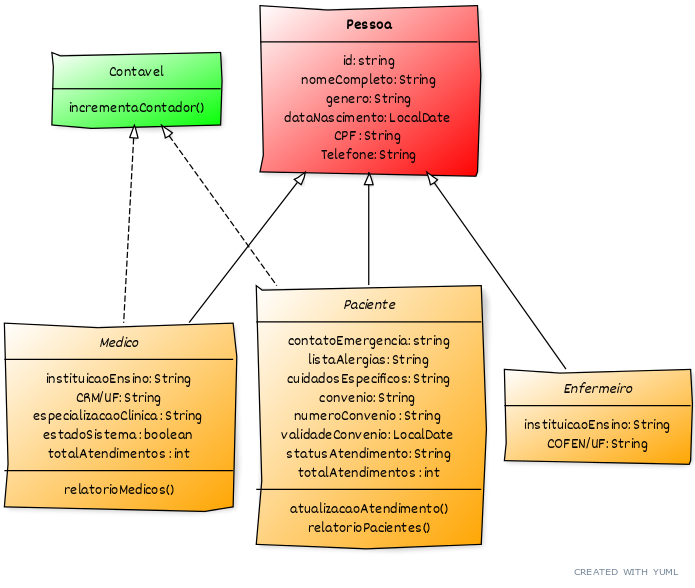

# Módulo 2 - Projeto Avaliativo 1

## Descrição  

A LABMedicine LTDA, empresa líder no segmento tecnológico para gestão hospitalar, está tomando algumas ações para testar e automatizar determinados processos nos atendimentos de pacientes em âmbito hospitalar. O seu perfil chamou a atenção dos gestores, para criar o Produto Viável Mínimo (Inglês: MVP) da aplicação Back-End, que deverá ser construída utilizando a linguagem de programação JAVA.

## Funcionalidades

* Atualização do Status de Atendimento do Paciente (Funcionalidade)
O sistema deve permitir alterar/atualizar a situação do status de atendimento de determinado paciente.
Essa opção deve ser exibida toda vez que o paciente é alterado ou quando uma outra ação é finalizada

* Realização de Atendimento Médico (Funcionalidades)
O sistema deve perguntar qual foi o médico e paciente que participaram do atendimento.
Sempre que um atendimento é realizado, devem ser incrementados os atributos de atendimento do paciente e médico envolvidos.
Sempre que um atendimento é realizado, o status do paciente deve ser alterado para “Em Atendimento”.

### O sistema também deverá apresentar os seguintes relatórios:

* Listagem de Pessoas: Listar todas as pessoas cadastradas, exibindo os campos código, nome e CPF.
O usuário deverá informar quais categorias de pessoas deseja listar dentre as opções abaixo:

1. Pacientes
2. Enfermeiros
3. Médicos
4. Todos

* Relatório dos Pacientes: exibindo os campos código, nome, convênio e total de atendimentos.
O usuário deve escolher quais pacientes serão listados de acordo com o status de atendimento abaixo:

1. Aguardando Atendimento
2. Em Atendimento
3. Atendido
4. Não Atendido
5. Todos

* Relatório dos Médicos: exibindo os campos código, nome, instituição de ensino, CRM e especialização.
O usuário deve escolher quais registros apresentar de acordo com as opções de especialização abaixo:

1. Clínico Geral
2. Anestesista
3. Dermatologia
4. Ginecologia
5. Neurologia
6. Pediatria
7. Psiquiatria
8. Ortopedia
9. Todos

## Principais Classes

